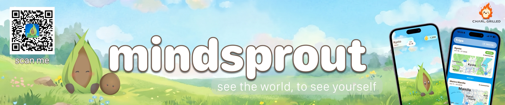

<p align="center">

  

</p>

<p align="center">

  

  

  

  

</p>

# Mindsprout

A week after a trip, most of it has already blurred together. Mindsprout keeps the moments worth keeping by making reflection a daily habit you actually stick to.

Each day of a trip you write or record one short reflection. That feeds a Sprout, a little plant that grows and evolves the longer you keep showing up.

**[Try the beta on TestFlight](https://testflight.apple.com/join/wFEfRRnW)**

## How it works

Start a trip and set what you want out of it. Solo, friends, family, or work, each kind asks slightly different questions. Then log one reflection a day, typed or spoken, with photos if you want. The same Sprout follows you from trip to trip, leveling up and evolving as your reflections add up.

## Stack

- Swift, iOS 26, iPhone only
- SwiftData, offline first, media stored on disk
- MVVM with Swift Observation
- On-device transcription (whisper.cpp, Apple Speech fallback)
- Rive framework for complex animations
- FabBar, for custom iOS tab bar with floating action button

## Structure

Grouped by feature, so most of what a screen needs sits in one place.

```
Mindsprout/
  App/             Entry point, the tab bar, app-wide routing and flags
  Core/
    Persistence/   SwiftData container setup
    Services/      Generated content, transcription, media files, content loading
    GameConfig/    Experience, levels, evolution stages, currency
    Extensions/    Small shared helpers
  DesignSystem/    Colors, type, buttons, cards, spacing, backgrounds
  Models/          Stored types: Trip, Reflection, MediaAsset, Sprout
  Features/
    Trips/         Trip list, detail, and the new-trip flow
    Reflection/    Daily reflection capture
    Sprout/        Home screen and the companion
    Profile/       Account and user settings
    Onboarding/    First-run intro
  Resources/       Bundled content files and the string catalog
  Assets.xcassets/ Images and colors
MindsproutTests/   Tests for the non-visual logic
```

## Built by

- Rishi Singhal
- Changrila Souksamlane
- Hiu Ying Lee (Ruby)
- Nam Ng. (Louis)
- Arshiya Banu Varada

